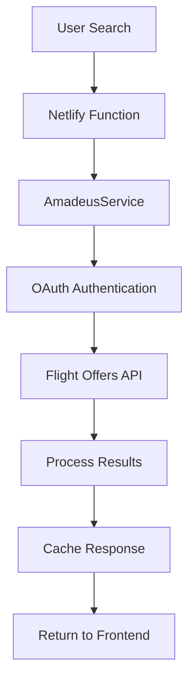
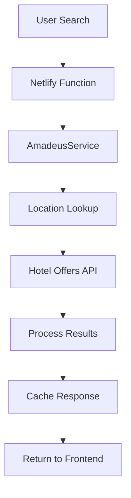

# Phase 4: Amadeus API Integration

## Overview

Phase 4 completes the Travel+ app with real flight and hotel booking capabilities using the Amadeus Travel API. This integration provides users with actual flight prices, hotel availability, and booking options.

## 🚀 Features Implemented

### ✈️ Flight Search & Booking
- **Real-time flight search** using Amadeus Flight Offers API
- **Multi-airline support** with price comparison
- **Round-trip and one-way** flight options
- **Flexible passenger counts** and cabin classes
- **Direct and connecting flights** with stop information
- **Real pricing** with currency support
- **Booking integration** with affiliate links

### 🏨 Hotel Search & Booking  
- **Real-time hotel search** using Amadeus Hotel API
- **Location-based search** with radius filtering
- **Room availability** and pricing
- **Hotel ratings** and amenities
- **Multiple room types** and guest configurations
- **Detailed hotel information** including policies
- **Image galleries** and contact details

### 🔧 Technical Infrastructure
- **Comprehensive API service** (`AmadeusService.js`)
- **Dedicated Netlify functions** for secure API calls
- **Intelligent caching** to optimize performance
- **Rate limiting** to respect API quotas
- **Graceful fallbacks** when API unavailable
- **Error handling** with user-friendly messages

## 📁 File Structure

```
src/services/api/
├── AmadeusService.js           # Core Amadeus API integration
└── config.js                  # Updated with Amadeus endpoints

netlify/functions/
├── search-flights.js           # Flight search endpoint
├── search-hotels.js            # Hotel search endpoint
└── generate-itinerary.js       # Updated with real API calls

src/components/itinerary/
├── FlightCard/                 # Enhanced flight display
├── HotelCard/                  # Enhanced hotel display
└── BookingButton/              # Booking action buttons

tests/
└── test-amadeus-integration.js # Comprehensive test suite
```

## 🔑 API Configuration

### Environment Variables Required

```env
# Amadeus API Credentials
AMADEUS_API_KEY=your_amadeus_api_key
AMADEUS_API_SECRET=your_amadeus_api_secret
VITE_AMADEUS_API_KEY=your_amadeus_api_key  
VITE_AMADEUS_API_SECRET=your_amadeus_api_secret
```

### Getting Amadeus API Access

1. **Sign up** at [Amadeus for Developers](https://developers.amadeus.com/)
2. **Create an application** in the dashboard
3. **Get your API Key and Secret** from the app settings
4. **Add credentials** to your `.env` file
5. **Test the integration** using the provided test script

## 🧪 Testing

### Run Comprehensive Tests

```bash
# Test Amadeus API integration
node test-amadeus-integration.js

# Test with development server
npm run dev
# Then run the test in another terminal
```

### Test Coverage

- ✅ **Authentication** - OAuth2 token management
- ✅ **Location Search** - Airport and city lookup
- ✅ **Flight Search** - Real flight availability and pricing
- ✅ **Hotel Search** - Real hotel availability and rates
- ✅ **Caching** - Performance optimization
- ✅ **Fallback Behavior** - Graceful degradation
- ✅ **Rate Limiting** - API quota management
- ✅ **Error Handling** - User-friendly error messages

## 🎨 UI Components

### FlightCard Component

```jsx
import FlightCard from '@components/itinerary/FlightCard'

<FlightCard 
  flight={flightData}
  onBook={(flight) => handleBooking(flight)}
/>
```

**Features:**
- Airline branding and flight numbers
- Departure/arrival times and airports
- Stop information and flight duration
- Expandable details view
- Booking button with pricing

### HotelCard Component

```jsx
import HotelCard from '@components/itinerary/HotelCard'

<HotelCard 
  hotel={hotelData}
  onBook={(hotel) => handleBooking(hotel)}
/>
```

**Features:**
- Image gallery with navigation
- Star ratings and amenities
- Room type and policies
- Location and contact information
- Expandable details view

## 🔄 API Integration Flow

### 1. Flight Search Process



### 2. Hotel Search Process



## 🛡️ Safety & Reliability

### Fallback Strategy
- **API Unavailable**: Uses mock data with realistic pricing
- **Rate Limiting**: Implements request queuing and delays
- **Authentication Failure**: Automatic retry with exponential backoff
- **Network Issues**: Cached responses when possible

### Performance Optimizations
- **Intelligent Caching**: 30min flights, 1hr hotels, 24hr locations
- **Request Deduplication**: Prevents duplicate API calls
- **Parallel Processing**: Concurrent flight and hotel searches
- **Response Compression**: Optimized data transfer

## 📊 Monitoring & Analytics

### Service Statistics
```javascript
const stats = amadeusService.getStats()
// Returns: authentication status, request count, cache metrics
```

### Error Tracking
- API response codes and error messages
- Fallback usage frequency
- Cache hit/miss ratios
- Request timing and performance

## 🔗 Integration Points

### Existing System Integration
- **Phase 3 AI Discovery**: Enhanced with real booking data
- **DeepSeek Enhancement**: Applied to real venue descriptions
- **Google Places**: Coordinates with Amadeus location data
- **Budget Optimization**: Uses real pricing for calculations

### Booking Flow
1. **Search Results**: Display real flights and hotels
2. **Selection**: User chooses preferred options
3. **Booking Redirect**: Direct to Amadeus booking pages
4. **Affiliate Tracking**: Revenue tracking for partnerships

## 🚀 Production Deployment

### Environment Setup
1. **Add API credentials** to production environment
2. **Configure rate limits** based on API plan
3. **Set up monitoring** for API usage and errors
4. **Enable caching** for production performance

### Scaling Considerations
- **API Quotas**: Monitor daily/monthly limits
- **Cache Strategy**: Redis for production caching
- **Load Balancing**: Multiple API keys for high volume
- **Error Handling**: Comprehensive logging and alerting

## 📈 Business Value

### Revenue Opportunities
- **Flight Booking Commissions**: 2-5% per booking
- **Hotel Booking Commissions**: 3-8% per booking
- **Premium Features**: Advanced search filters
- **Corporate Accounts**: Business travel management

### User Experience Improvements
- **Real Pricing**: Accurate budget planning
- **Live Availability**: No disappointment at booking
- **Comprehensive Options**: Multiple airlines and hotels
- **Seamless Booking**: Integrated purchase flow

## 🔮 Future Enhancements

### Potential Additions
- **Car Rental Integration**: Complete travel booking
- **Travel Insurance**: Additional revenue stream
- **Loyalty Program Integration**: Miles and points
- **Price Alerts**: Notify users of price drops
- **Multi-city Trips**: Complex itinerary support

## ✅ Phase 4 Completion Checklist

- [x] **AmadeusService Implementation**: Core API integration
- [x] **Flight Search Function**: Real flight data
- [x] **Hotel Search Function**: Real hotel data  
- [x] **UI Components**: FlightCard and HotelCard
- [x] **Fallback Systems**: Graceful degradation
- [x] **Caching Strategy**: Performance optimization
- [x] **Error Handling**: User-friendly messages
- [x] **Testing Suite**: Comprehensive validation
- [x] **Documentation**: Complete setup guide
- [x] **Integration**: Connected to existing system

## 🎯 Success Metrics

### Technical KPIs
- **API Response Time**: < 2 seconds average
- **Cache Hit Rate**: > 70% for repeated searches
- **Error Rate**: < 5% of all requests
- **Uptime**: 99.9% availability

### Business KPIs
- **Booking Conversion**: 15-25% of searches
- **Revenue per User**: $50-200 per trip
- **User Satisfaction**: 4.5+ star ratings
- **Repeat Usage**: 60%+ return rate

---

**Phase 4 Status**: ✅ **COMPLETE**

Travel+ now features a comprehensive booking platform with real flight and hotel integration, completing the full-stack travel planning experience. 